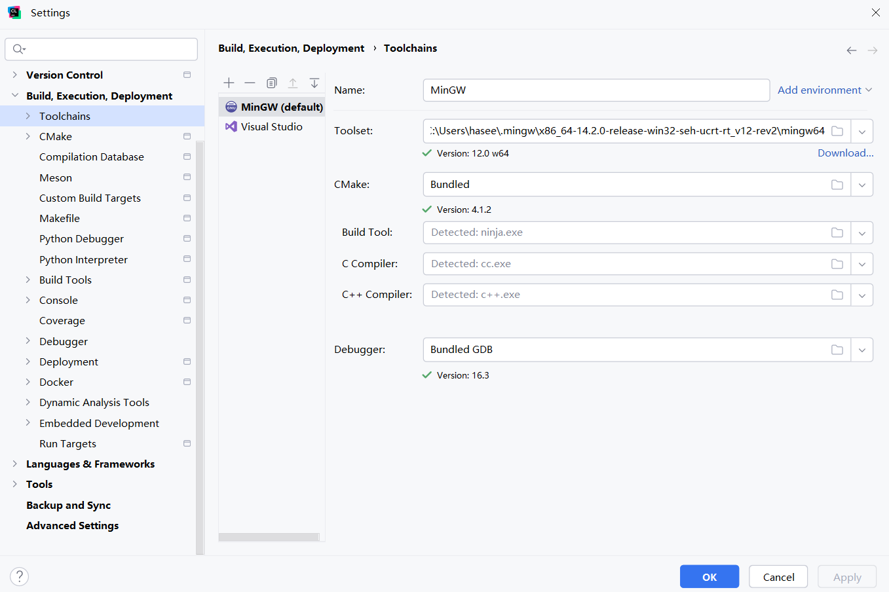

## jetbrains Clion集成开发环境
在Setting->Build,Execution,Deployment->Toolchains

支持MinGW平台和visual studio平台



选择以MinGW平台为例
- Toolset: 支持手动下载指定mingw版本, 默认使用Clion中自带绑定的
- CMake: 支持手动下载指定cmake版本, 默认使用Clion中自带绑定的

例如我下载了多个(3)mingw版本, 放在了用户目录C:\Users\hasee\.mingw, 可以为项目自由选择不同的mingw版本
```
C:\Users\hasee\.mingw>dir
 Volume in drive C has no label.
 Volume Serial Number is 5CD0-2D9F

 Directory of C:\Users\hasee\.mingw

2025/12/21  22:56    <DIR>          .
2025/12/21  22:56    <DIR>          ..
2025/12/21  22:55    <DIR>          x86_64-13.2.0-release-win32-seh-ucrt-rt_v11-rev1
2025/12/21  11:24    <DIR>          x86_64-14.2.0-release-win32-seh-ucrt-rt_v12-rev2
2025/12/15  10:59    <DIR>          x86_64-15.2.0-release-win32-seh-ucrt-rt_v13-rev0
               0 File(s)              0 bytes
               5 Dir(s)  216,971,264,000 bytes free
```

我指定Toolset路径: C:\Users\hasee\.mingw\x86_64-13.2.0-release-win32-seh-ucrt-rt_v11-rev1\mingw64

我指定CMake路径为bundled: C:\Program Files\JetBrains\CLion 2025.3.1\plugins\cmake\lib

最新版clion默认支持ninja构建工具, 采用多线程比make更快

最新版clion默认支持nova/clangd语言服务器, 在代码重构导航方面更快更省内存
